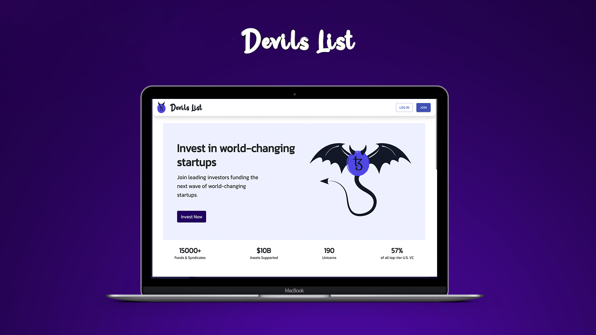
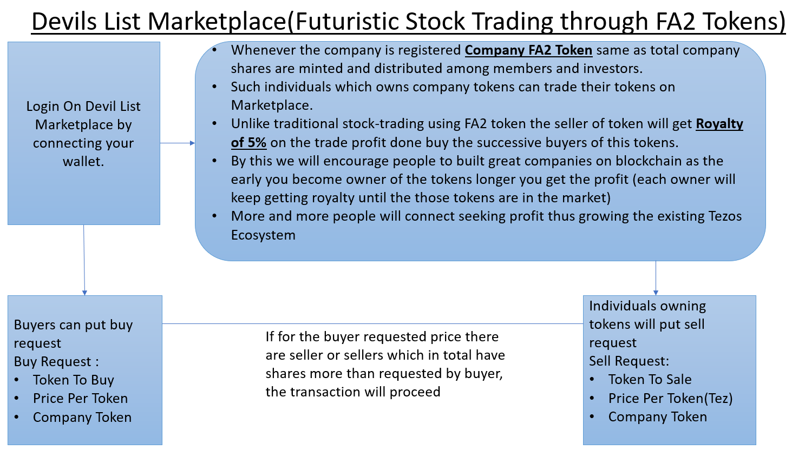
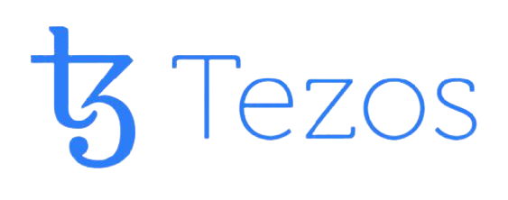
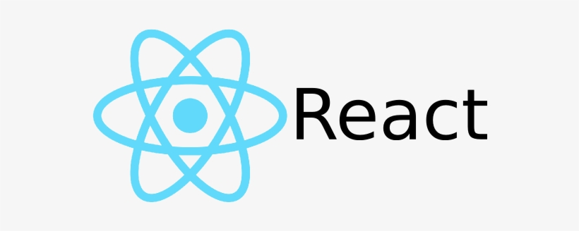

<!-- Improved compatibility of back to top link: See: https://github.com/othneildrew/Best-README-Template/pull/73 -->

<!-- PROJECT SHIELDS -->
<!--
* I'm using markdown "reference style" links for readability.
* Reference links are enclosed in brackets [ ] instead of parentheses ( ).
* See the bottom of this document for the declaration of the reference variables
* for contributors-url, forks-url, etc. This is an optional, concise syntax you may use.
* https://www.markdownguide.org/basic-syntax/#reference-style-links

<!-- PROJECT LOGO -->
 

  <!--  -->

  <h1 align="center"> DevilsList </h1>

  

    An On-Chain AngelList on Tezos BlockChain!
     
    <a href="https://github.com/othneildrew/Best-README-Template"><strong>Explore the docs »</strong></a>
     
    <a href="https://youtu.be/m3xArqbYJ1A">View Demo</a>
    .
    <a href="https://decentralizedangellist.web.app">View Site</a>
    <!-- <a href="https://github.com/othneildrew/Best-README-Template/issues">Report Bug</a>
    ·
    <a href="https://github.com/othneildrew/Best-README-Template/issues">Request Feature</a> -->
  

<!-- TABLE OF CONTENTS -->

  
Table of Contents

  <ol>
    <li><a href="#about-the-project">About The Project</a></li>
    <li><a href="#getting-started">Tech-Stack</a></li>
    <li><a href="#usage">Challenges Faced</a></li>
    <li><a href="#contributing">Future Aspects and Scope</a></li>
    <li><a href="#license">Guide to setup the project locally</a></li>
    <li><a href="#contract-address">Contract Address</a></li>
    <li><a href="#acknowledgments">Acknowledgments and References</a></li>
    <li><a href="#contact">Project Demo Pictures</a></li>

  </ol>

## About The Project

### Inspiration 

With the world rapidly accepting and appreciating blockchain and decentralised ecosystems, it is imperative that major sites such as AngelList migrate to WEB3. New firms will be built on WEB3, and blockchain token transactions will be a major element of monetary transactions in the near future.
Moreover Payments, loans, and borrowing were formerly only available through established financial institutions including banks. However, things changed with the arrival of blockchain technology. When the notion of cryptocurrencies began to grow in popularity, the conversation switched to a new set of issues, namely, decentralised finance (DeFi) Decentralized finance fosters an equitable and transparent financial system in which anybody may participate. It uses blockchain technology to provide unbanked individuals with access to financial and banking services.

The goal of DeFi is to create an open-source, permissionless, and transparent financial services ecosystem. As a result, having a platform like AngelList is essential today.

### Introduction

DevilsList is an end-to-end platform where investors may invest in businesses using tez/USDT and sign SAFT/SAFEs directly on the site. When a round closes, this website keeps track of the cap-table, and entrepreneurs may pay their workers and vendors in tez/USDT. It is a fantastic programme for investing, raising funds, maintaining a cap-table, managing cash-flow, and doing payroll and accounting on-chain.

### Features

DevilsLsit is a fully-decentralised app where investors can finance a variety of new firms through SAFE notes, SAFTs or direct ownership.
The flowchart above demonstrates how our website's fund-raising event works.

### Exclusive Features
#### DevilsList Marketplace

Our goal was to develop a single, all-encompassing blockchain application that would allow users to invest, raise money, monitor cash flow, and more. DevilsList is a one-stop shop for all of your requirements, as my friends have very clearly explained. But as we worked to establish this product, we came to the realisation that, despite our best efforts to link investors and entrepreneurs, it is inevitable that startups will have to give up some equity in order to receive funding. What if we could devise a different means of obtaining funding for such startups? Thus, we developed the concept for DevilList Marketplace.

Every company that registers on DevilList will receive a set of FA2 Fungible Company Tokens. These tokens are comparable to shares, however they are exclusively available on DevilList . The number of company tokens each founder and member wants to possess as a member must be entered whenever the firm registers itself and they are added as we have seen previously. The entire number of tokens that the company owns is determined when all members have been added, and the initial token price is set to the company's total valuation divided by the total token. These tokens can now be traded on the DevilList Market Place like shares. Anyone who wants to buy this token can log in to DevilMarket Place and submit a buy request. 
 
Unlike with regular shares, the seller of this token will continue to receive 5% of any trade profits made by subsequent buyers of this token. Therefore, after 20 successful trades involving these tokens, they will no longer exist. As is obvious, the sooner you become the token's owner, the more and longer you can earn. 
As a result, the majority of people will purchase these tokens from firm members as quickly as possible, helping to finance the startup in its  early stages. 
Also the subsequent buyers, analyse company's valuation and trade this token similar to regular trading with 5% Royalty going to company. This will assist in ensuring a steady flow of funding for the business.

#### Decentralized Peer-to-Peer Chat Application

Most platforms offer only a global or general chating service on decentralized applications but on Devilslist decentralized peer-to-peer communication is possible. This one on one chatting service provides a more personalized experience to the investors and the companies to negotiate in investements.

<!-- Here's why:
* Your time should be focused on creating something amazing. A project that solves a problem and helps others
* You shouldn't be doing the same tasks over and over like creating a README from scratch
* You should implement DRY principles to the rest of your life :smile:

Of course, no one template will serve all projects since your needs may be different. So I'll be adding more in the near future. You may also suggest changes by forking this repo and creating a pull request or opening an issue. Thanks to all the people have contributed to expanding this template! -->

<!-- Use the `BLANK_README.md` to get started. -->

### Tech-Stack

    
💲  Tezos - Evolutionary, revolutionary, and everything in-between.  
📷 IPFS is a peer-to-peer hypermedia protocol designed to preserve and grow humanity's knowledge.  

<a href="#readme-top">Top</a>

## Challenges Faced
We are new to the Tezos Block chain are so we ran into soem issues while the duration of this project,
1. It took major time to resolve erros in smartpy due to lack of proper error messages and documentation regarding the errors.
2. The Becon Wallet was not compatible with the latest React JS version (18) due to which we had to use version 16.
3. The resources for the working of Angellist were scarce.

### Major issues
2 days prior to the deadline, the infura ipfs service stopped working due to which we had to switch to a different service
(nft.storage). This caused a major backlash due to which we had to restructure the project accordingly. If not for this
inconvenience we would have implemented more features we had initially decided.

<a href="#readme-top">Top</a>

## Future Aspects and Scope
Royalty On FA2 Company Tokens: 
Unlike traditional stock-trading using FA2 token the seller of token will get Royalty of 5% on the trade profit done buy the successive buyers of this tokens.
By this we will encourage people to built great companies on blockchain as the early you become owner of the tokens longer you get the profit (each owner will keep getting royalty until the those tokens are in the market). The above feature is already half implemented.

CRON jobs : Introducing CRON jobs to automate the buying and selling FA2 company tokens (which are currently being triggered by confirmations) instead directly initiate tokens transfer whenever avaliable at the buyer's price.

Coinbase: If any user on the platform is deficiet of Tez instead of going to other platforms for buying tez he can buy tez directly from our platform. By making this buying process easy we will encourage the users to keep trading in Tez which will help in growth of Tezos Ecosystem. The above feature is almost close to completition.

USDT/USDC: According to the research USDT stable coin has came on the Tezos blockchain recently in June 2022. USDC.e is coin on ethereum blockchain. For allowing the transactions in USDC.e there need to build an bridge between the two blockchain. We hope to enable transactions in this two coins in the near future.

<a href="#readme-top">Top</a>

## Guide to setup the project locally
### Prerequisites

- Python 3.x +
- Node v12.x +

<a href="#readme-top">Top</a>

### Setup, Run, Compile & Deploy Steps :

1.  `npm install` it will install all your dependencies

2.  `npm run client-install` it will install all the client dependencies i.e in React

> If step 2 does not work then go to the 'client' directory and run 'npm install'

3.  `npm run sync` this is a syncing command. Whenever the compile_config is changed in config.json this command must be executed from the terminal. This command helps the bundle to reconfigure the compilation parameters according to the changes you have made.

4.  `npm run compile` will build the contracts locally inside the folder ./contract_build. This command compiles the python file to a Michelson file and stores it in the ./contract_build folder.

5.  `npm run deploy` will deploy your contract with the params respect to your config.json

6.  `npm run dapp` It will spin-up the Dapp front-end and you are ready to use it. This Bundle is packed up with simple create-react-app. Once you run the command the front-end dev server will start up and you will be redirected to your home page in your default browser.

7.  `npm run test` It will run the whole template of SmartPy code with their scenario based testing. And the test results will be visualised in the teminal.
>Step 7 will also generate a test_build where your test results will be stored.

8.  `npm run get-entry-points` It will extract the entry-points from you recently compiled code and display in the terminal with a sample invocation which you can reference while invoking an entry-point from your dapp.
9.  *`npm run sync` is mandatory whenever your config.json file is changed !*

<a href="#readme-top">Top</a>

## Contract Address
### KT1Hm63JnL6ZCypjWgH4Xnr9tETpkbz48q5H

<!-- ACKNOWLEDGMENTS -->
## Acknowledgments and References

* [Infura](https://infura.io/)
* [Taquito](https://tezostaquito.io/)
* [Smartpy](https://smartpy.io/)
* [Tezos](https://opentezos.com/)
* [Axios](https://axios-http.com/docs/intro)
* [TZKT APi](https://api.tzkt.io/)
* [React](https://reactjs.org/docs/getting-started.html)
* [Fusion Charts](https://www.fusioncharts.com/fusioncharts)
* [README Template](https://github.com/othneildrew/Best-README-Template/edit/master/README.md)

<a href="#readme-top">Top</a>

## Project Demo Pictures
You can refer the sample shots our projects <a href="https://drive.google.com/drive/folders/1vyppSZRm_aS8BcY_G4efxLQuYp651AkP?usp=sharing">Click Here</a>

(<a href="#readme-top">Top</a>)

