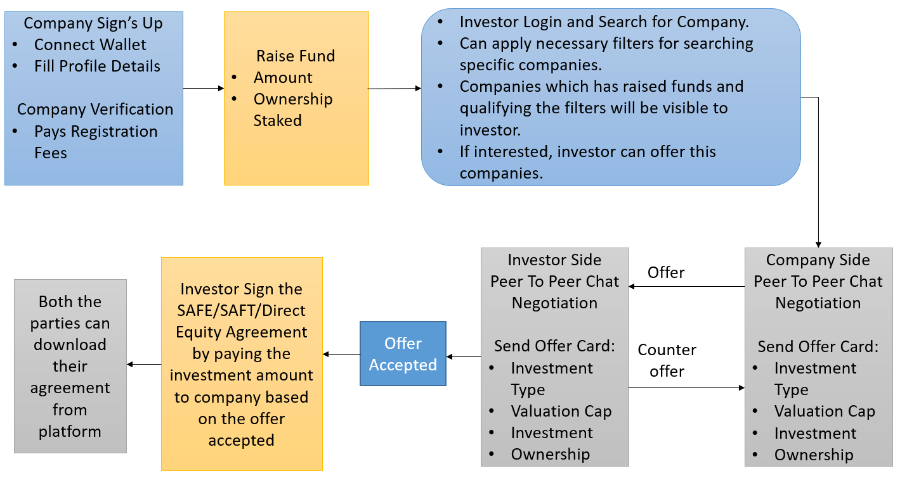

<!-- Improved compatibility of back to top link: See: https://github.com/othneildrew/Best-README-Template/pull/73 -->

<!-- PROJECT SHIELDS -->
<!--
* I'm using markdown "reference style" links for readability.
* Reference links are enclosed in brackets [ ] instead of parentheses ( ).
* See the bottom of this document for the declaration of the reference variables
* for contributors-url, forks-url, etc. This is an optional, concise syntax you may use.
* https://www.markdownguide.org/basic-syntax/#reference-style-links

<!-- PROJECT LOGO -->
 

  <!--  -->

  <h1 align="center"> DevilsList </h1>

  

    An On-Chain AngelList !
     
    <a href="https://docs.google.com/presentation/d/1bjLGVsfaebmOhMgbCX7O-pmUoJv1ZaAB5pmj_FkttRc/edit?usp=sharing"><strong>Explore Docs »</strong></a>
     
    <a href="https://youtu.be/L814VAG9_dc">View Demo</a>
    .
    <a href="https://decentralizedangellist.web.app">View Site</a>
    <!-- <a href="https://github.com/othneildrew/Best-README-Template/issues">Report Bug</a>
    ·
    <a href="https://github.com/othneildrew/Best-README-Template/issues">Request Feature</a> -->
  

<!-- TABLE OF CONTENTS -->

  
Table of Contents

  <ol>
    <li><a href="#about-the-project">About The Project</a></li>
    <li><a href="#getting-started">Tech-Stack</a></li>
    <li><a href="#usage">Challenges Faced</a></li>
    <li><a href="#contributing">Future Aspects and Scope</a></li>
    <li><a href="#license">Guide to setup the project locally</a></li>
    <li><a href="#contract-address">Contract Address</a></li>
    <li><a href="#acknowledgments">Acknowledgments and References</a></li>
    <li><a href="#contact">Project Demo Pictures</a></li>

  </ol>

## About The Project

### Inspiration 

In today's tech landscape, the future belongs to blockchain and AI. AI is rapidly becoming an essential part of all industries. However, there's a gap when it comes to accessing AI models. Existing platforms either force users to buy expensive models or provide complex files that require technical expertise to use. Small businesses, in particular, struggle with this. They can't afford pricey models, and integrating them is a challenge.

Moreover, even if businesses buy a model, it may not be a wise investment. The AI landscape is evolving rapidly, with new and better-performing models emerging constantly.

That's why we're introducing Rent.AI. It's a game-changer. Our platform allows anyone to rent AI models as needed, removing the complexity of setup and the burden of high costs. Creators can showcase their models, while users can rent and utilize them effortlessly. We handle all the infrastructure, so you just input your data and get results. With the world embracing blockchain and decentralized systems, Rent.AI is at the forefront, unlocking the full potential of AI for everyone

The goal of Rent.AI is to create an open-source, permissionless, and transparent financial services ecosystem. As a result, having a platform like Rent.AI is essential today.

### Introduction

In a dynamic landscape where Web3, blockchain, AI, and decentralized finance (DeFi) are reshaping the future of technology and finance, we proudly present DevilList—an innovative and forward-thinking web application. DevilList emerges as a groundbreaking solution designed to address the evolving needs of investors, startups, and entrepreneurs in this rapidly changing environment.

Our vision for DevilList is rooted in the recognition that the intersection of blockchain technology, artificial intelligence, and decentralized ecosystems is fundamentally altering the way businesses and investors interact. We believe that the integration of these technologies is paramount for the continued growth and success of businesses in the Web3 era.

As blockchain token transactions and AI-driven solutions take center stage in financial and technological advancements, DevilList aims to be at the forefront of this revolution

### Features
<!--  -->

#### Connecting Businesses to Investors and Employees
Devils List is the essential link connecting investors and companies. It enables direct funding, manages Cap-Tables for accurate tracking, and offers seamless Tez/USDT payroll solutions for entrepreneurs. This platform empowers financial collaboration and growth in the Web3 era

#### Digital Contracts (SAFE’s, SAFT’s, Direct Equity)
Devils List offers legitimate and user-friendly online digital contracts. These contracts are backed by PDF copies and NFTs, ensuring authenticity and scalability for any changes in Terms and Conditions

#### Peer to Peer Decentralized Chat
Most platforms offer only a global or general chating service on decentralized applications but on Devilslist decentralized peer-to-peer communication is possible. This one on one chatting service provides a more personalized experience to the investors and the companies to negotiate in investements

#### DevilsList Marketplace

We created DevilsList as a one-stop blockchain app for investment, fundraising, and cash flow monitoring. Recognizing the need for startups to secure funding, we introduced DevilList Marketplace.

Each registered company receives FA2 Fungible Company Tokens, exclusive to DevilsList, serving as shares. These tokens are tradable on the marketplace, with sellers earning 5% of trade profits. Early ownership incentivizes funding, and subsequent buyers ensure a steady funding stream while trading these tokens like regular shares, with 5% going to the company.

#### AI Recommendations and Business Analytics

DevilsList leverages the power of AI to fortify its foundation. AI conducts precise matchmaking between startups and investors based on preferences and historical data, ensuring strategic connections. It optimizes investor portfolios with diverse startup suggestions for risk management and offers real-time market insights, fostering informed decision-making. Additionally, AI provides personalized startup job recommendations, aligning opportunities with user skills and goals, making DevilsList a comprehensive and data-driven platform

<!-- Here's why:
* Your time should be focused on creating something amazing. A project that solves a problem and helps others
* You shouldn't be doing the same tasks over and over like creating a README from scratch
* You should implement DRY principles to the rest of your life :smile:

Of course, no one template will serve all projects since your needs may be different. So I'll be adding more in the near future. You may also suggest changes by forking this repo and creating a pull request or opening an issue. Thanks to all the people have contributed to expanding this template! -->

<!-- Use the `BLANK_README.md` to get started. -->

### Tech-Stack
* [Tezos](https://tezos.com/)
* [IPFS](https://infura.io/)
* [Smartpy](https://smartpy.io/)
* [React](https://reactjs.org/)

<a href="#readme-top">Top</a>

## Challenges Faced
Complex ML Model Training: Developing robust machine learning models for analytics required extensive research and time, with challenging data acquisition and testing.

Decentralization Challenge: Achieving complete decentralization involved exhaustive research, especially in combining IPFS and blockchain for secure, transparent storage.

Document Signing Research: Implementing secure digital document signing required in-depth exploration of procedures and terms, ensuring user trust and legal compliance.

Integration Complexity: Seamlessly connecting intricate machine learning models into our application's backend was a formidable task, demanding meticulous planning and execution.

Scarce Resource: Securing essential resources for our tech stack was a significant challenge, leading to extended issue resolution and project functionality timelines.

<a href="#readme-top">Top</a>

## Future Aspects and Scope
Bitget Exchange Integration: 
Expand your crypto exchange's reach by integrating with Bitget, providing users with access to a wider range of trading options and further enhancing liquidity and trading opportunities.

Automation using CRON jobs: 
Streamline administrative tasks, improve efficiency, and ensure timely execution of critical functions, optimizing overall platform performance.

Incorporate both direct and indirect taxes on financial transfers: 
Ensure regulatory compliance and transparency while offering users a comprehensive financial experience.

Using Digital Signatures in legal agreements: 
Enhance security and trustworthiness of contracts, attracting more users and businesses to conduct transactions on your platform.

AI for Market Analysis and Prediction: 
Empower users with valuable market insights, enabling more informed investment decisions and increasing user confidence.

Real-Time High-Frequency Token Trading: 
Attract professional traders and liquidity, making your platform a go-to destination for fast and efficient cryptocurrency trading

<a href="#readme-top">Top</a>

## Guide to setup the project locally
### Prerequisites

- Python 3.x +
- Node v12.x +

<a href="#readme-top">Top</a>

### Setup, Run, Compile & Deploy Steps :

1.  `npm install` it will install all your dependencies

2.  `npm run client-install` it will install all the client dependencies i.e in React

> If step 2 does not work then go to the 'client' directory and run 'npm install'

3.  `npm run sync` this is a syncing command. Whenever the compile_config is changed in config.json this command must be executed from the terminal. This command helps the bundle to reconfigure the compilation parameters according to the changes you have made.

4.  `npm run compile` will build the contracts locally inside the folder ./contract_build. This command compiles the python file to a Michelson file and stores it in the ./contract_build folder.

5.  `npm run deploy` will deploy your contract with the params respect to your config.json

6.  `npm run dapp` It will spin-up the Dapp front-end and you are ready to use it. This Bundle is packed up with simple create-react-app. Once you run the command the front-end dev server will start up and you will be redirected to your home page in your default browser.

7.  `npm run test` It will run the whole template of SmartPy code with their scenario based testing. And the test results will be visualised in the teminal.
>Step 7 will also generate a test_build where your test results will be stored.

8.  `npm run get-entry-points` It will extract the entry-points from you recently compiled code and display in the terminal with a sample invocation which you can reference while invoking an entry-point from your dapp.
9.  `npm run sync` is mandatory whenever your config.json file is changed !

<a href="#readme-top">Top</a>

## Contract Address
### KT1RgCskZanXW1mtz4aeFB9txG5Uce454V3q

<!-- ACKNOWLEDGMENTS -->
## Acknowledgments and References

* [Infura](https://infura.io/)
* [Taquito](https://tezostaquito.io/)
* [Smartpy](https://smartpy.io/)
* [Tezos](https://opentezos.com/)
* [Axios](https://axios-http.com/docs/intro)
* [TZKT APi](https://api.tzkt.io/)
* [React](https://reactjs.org/docs/getting-started.html)
* [Fusion Charts](https://www.fusioncharts.com/fusioncharts)
* [README Template](https://github.com/othneildrew/Best-README-Template/edit/master/README.md)

<a href="#readme-top">Top</a>

## Project Demo Pictures
You can refer the sample shots our projects <a href="https://drive.google.com/drive/folders/1HcQrkdnlIA9o4tYNpDbzngM5WnvX5ajB?usp=sharing">Click Here</a>

(<a href="#readme-top">Top</a>)

